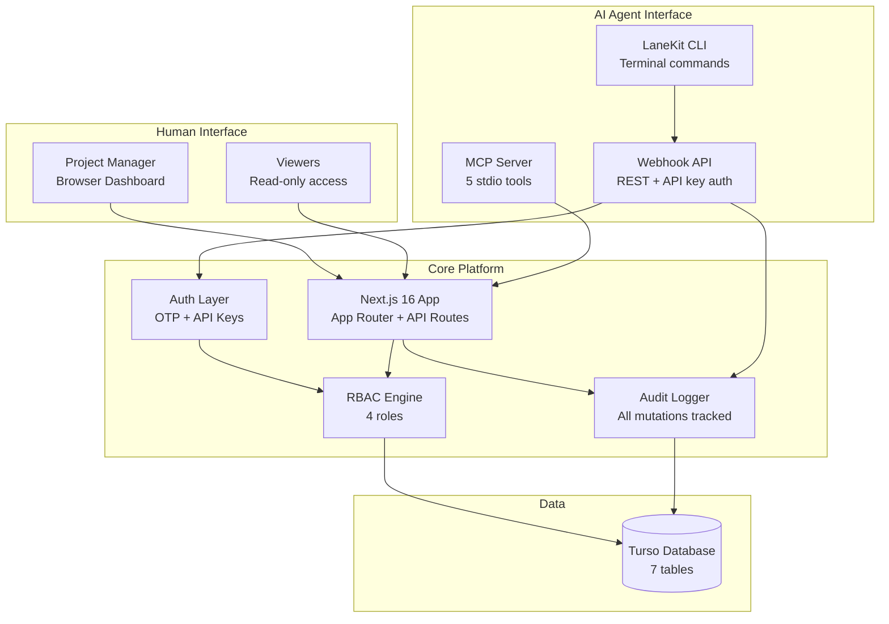
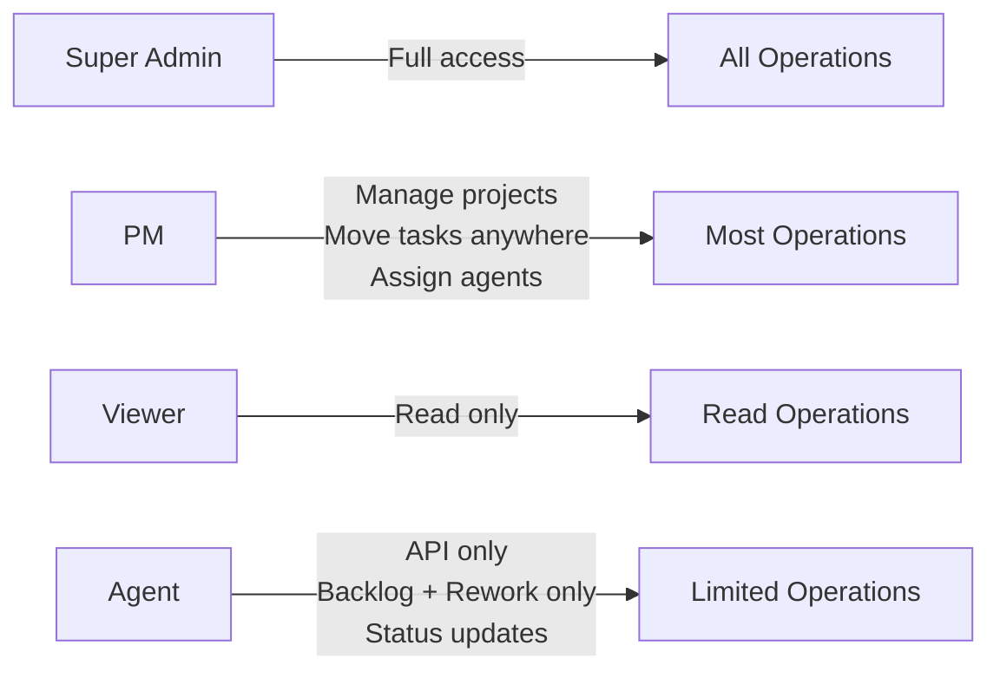

# aiVelox — AI Agent Coordination Platform

## The Problem

AI coding assistants (Claude Code, Gemini, Cursor) are increasingly doing real development work — writing code, fixing bugs, running tests. But when a project manager coordinates multiple AI agents working on different tasks simultaneously, there's no visibility:

- Which agent is working on what?
- Is Agent A blocked or still running?
- Did Agent B find issues that affect Agent C's work?
- What did each agent actually do?

Traditional PM tools (Jira, Linear) weren't designed for AI agents as team members.

## My Approach

I built a Kanban-based project management platform where **AI agents are first-class participants**. Agents don't just receive tasks — they actively manage their own lifecycle:

- Pick up tasks from the sprint column
- Update their status (working / waiting / done)
- Add notes about progress or blockers
- Move tasks to rework when they find bugs
- Create new tasks they discover during work

This happens through two integration points: an **MCP server** (for AI assistants that support MCP) and a **webhook API** (for any system that can make HTTP calls).

## Architecture



## The MCP Server — Technical Deep Dive

MCP (Model Context Protocol) is an emerging standard for AI assistants to interact with external tools. aiVelox implements an MCP server that exposes 5 tools:

| Tool | What It Does | Who Uses It |
|------|-------------|-------------|
| `aivelox_get_tasks` | Fetch tasks for a project, optionally filtered by column | Agent checks what's in Sprint |
| `aivelox_add_task` | Create a new task (backlog or rework only) | Agent found a bug, logs it |
| `aivelox_update_status` | Set AI work status (working/waiting/done) | Agent reports progress |
| `aivelox_move_to_rework` | Flag a task as needing rework with reason | Agent can't complete task |
| `aivelox_add_note` | Add a note/comment to a task | Agent documents what it did |

**Key constraint:** Agents can only add tasks to backlog or rework columns. They cannot move tasks to "Approved" or "Deployed" — that requires human (PM) judgment. This is a deliberate trust boundary.

## RBAC Model



Four roles with clear boundaries. The Agent role is intentionally restricted — AI agents are powerful tools, but they shouldn't approve their own work for production deployment.

## Key Technical Decisions

### Why MCP + Webhooks (not just one)?
- **MCP** is native to AI assistants (Claude Code, Gemini). Zero configuration for agents that support it — they discover tools automatically.
- **Webhooks** work with anything that can make HTTP requests — CI/CD pipelines, custom scripts, AI agents without MCP support.
- Both feed into the same auth → RBAC → audit pipeline. One source of truth.

### Why SHA-256 hashed API keys?
API keys are stored as SHA-256 hashes, not plaintext. If the database is compromised, keys aren't exposed. Same principle as password hashing, but without the overhead of bcrypt (API keys are already high-entropy).

### Why audit logging on everything?
When AI agents autonomously modify project state, you need a complete record. Every mutation (human or agent) is logged with: who, what, when, and the before/after state. This isn't just good practice — it's essential for debugging agent behavior.

## What I Learned

1. **MCP is the right abstraction for human-AI collaboration.** REST APIs require the AI to understand your endpoint structure. MCP tools are self-describing — the AI reads the tool definition and knows how to use it. Much less friction.

2. **Trust boundaries matter more with AI agents.** A human team member who moves a task to "Deployed" made a judgment call. An AI agent doing the same thing is just following instructions — it doesn't understand the consequences. Design your permissions accordingly.

3. **Audit trails are non-negotiable.** I thought I was over-engineering the audit logging. Then I spent an afternoon debugging why a task appeared in rework with no context. The audit log showed exactly which agent moved it and why. Worth every line of code.

## Stack

| Layer | Technology | Why |
|-------|-----------|-----|
| Frontend | Next.js 16, React 19 | Server components, API routes |
| Drag & Drop | @dnd-kit | Accessible, performant Kanban interactions |
| Database | Turso (edge SQLite) | Fast reads for dashboard, global edge |
| MCP | stdio server via tsx | Native AI assistant integration |
| Auth | OTP (email) + API keys (agents) | Different auth for different actors |
| Security | SHA-256 key hashing, rate limiting | API key security without bcrypt overhead |
| Audit | Custom audit log table | Every mutation tracked for debugging |

## Companion Tool: LaneKit CLI

LaneKit is a command-line tool that agents (or developers) can use to interact with aiVelox from the terminal:

```bash
lanekit move --id TASK-42 --status in_development
lanekit log --id TASK-42 --message "Fixed the auth middleware bug"
lanekit status  # View the board
```

This enables AI coding agents (running in terminal) to update their task status without needing MCP support.
