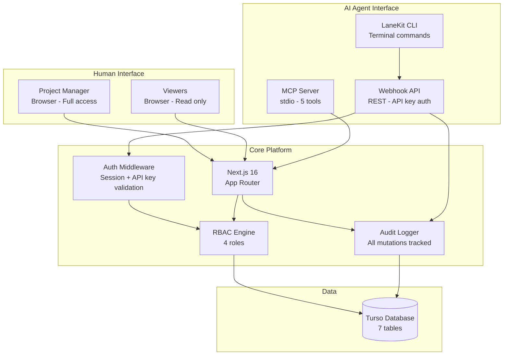
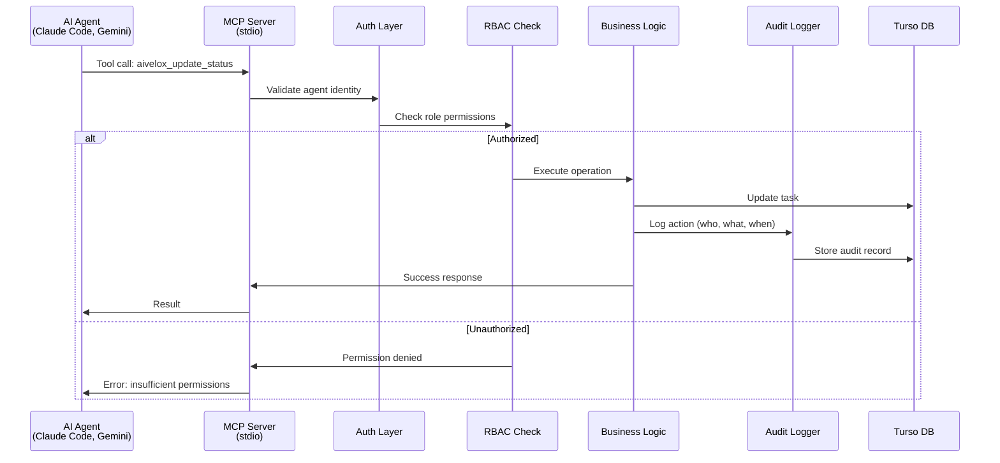
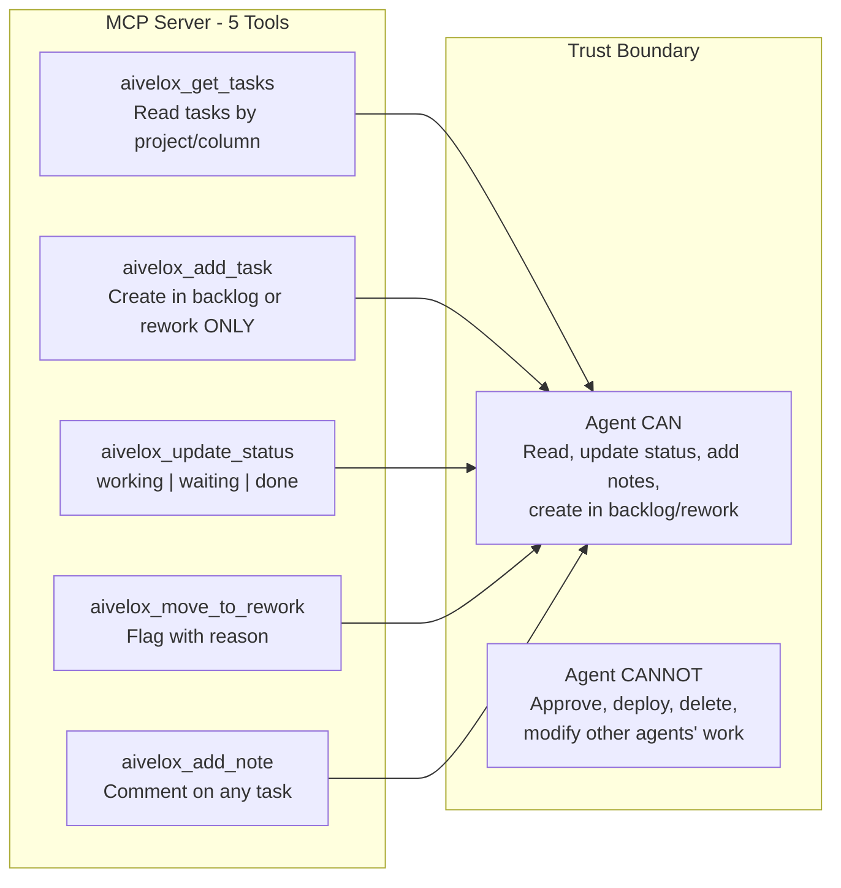
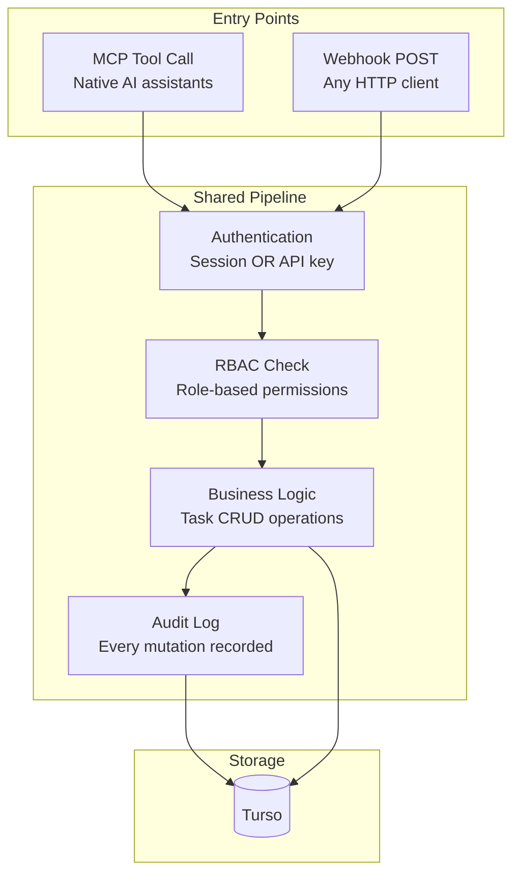
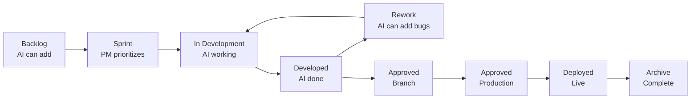
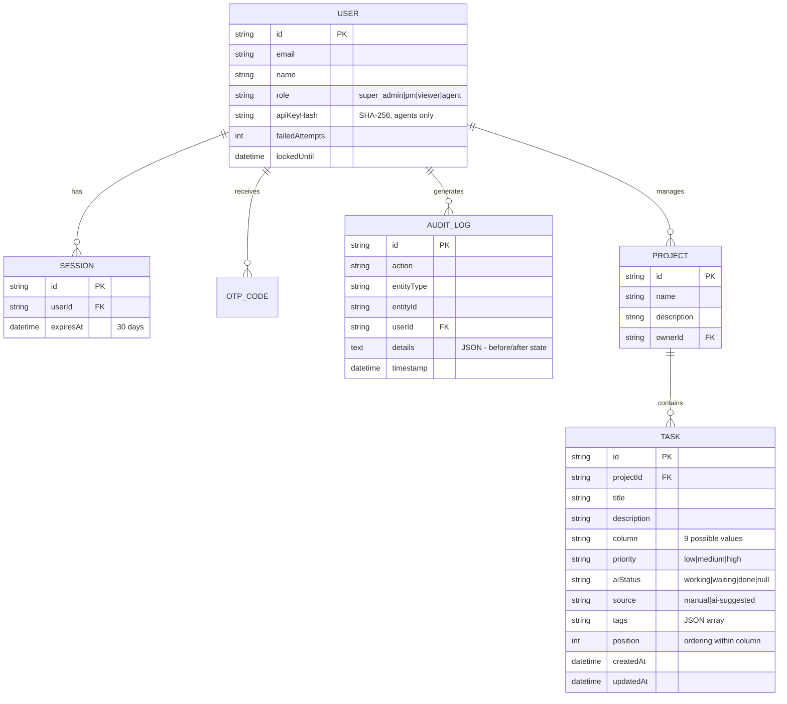
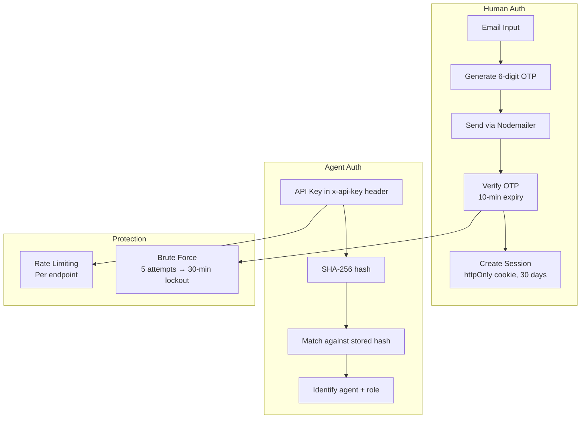

# aiVelox — Architecture

## System Overview

## MCP Integration Architecture

## MCP Tools

**Design principle:** AI agents are powerful executors but should not make judgment calls about production readiness. The PM reviews and promotes. The agent reports and suggests.

## Dual Integration: MCP + Webhooks

Both entry points converge at the auth layer. One codebase, one audit trail, consistent security.

## Kanban Workflow (9 Columns)

**Column access by role:**

| Column | PM | Agent | Viewer |
|--------|-----|-------|--------|
| Backlog | Read/Write | Add only | Read |
| Sprint → Developed | Read/Write | Status updates | Read |
| Rework | Read/Write | Add + move to | Read |
| Approved → Archive | Read/Write | No access | Read |

## Data Model

## Authentication Architecture

**Why SHA-256 for API keys (not bcrypt)?** API keys are already high-entropy random strings. bcrypt's salting and cost factor protect weak passwords — unnecessary for 256-bit keys. SHA-256 is faster and sufficient.

## Technology Choices

| Decision | Choice | Why Not the Alternative |
|----------|--------|----------------------|
| Agent protocol | MCP (primary) + Webhooks (fallback) | MCP is self-describing — agents discover tools automatically. Webhooks for non-MCP agents. |
| Database | Turso (edge SQLite) | Fast reads for dashboard. PostgreSQL unnecessary for task management data volume. |
| Drag & drop | @dnd-kit | Accessible, performant. react-beautiful-dnd is deprecated. |
| Auth (humans) | OTP via email | No passwords to manage. Simple, secure, friction-appropriate. |
| Auth (agents) | API keys (SHA-256 hashed) | Stateless, no session management needed for machine clients. |
| Audit storage | Same database | Separate audit DB would add complexity without benefit at this scale. |
| MCP transport | stdio | Standard for local AI assistants. HTTP transport planned for remote agents. |
