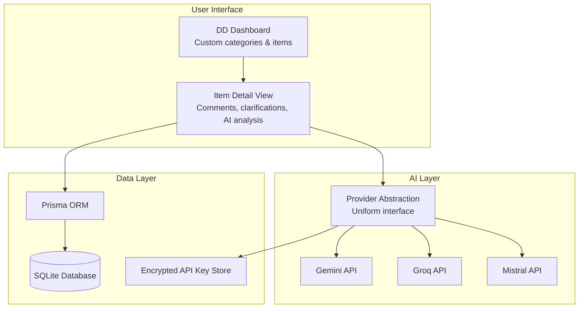

# Claritas — AI-Assisted Due Diligence Platform

## The Problem

IT due diligence in M&A is a structured but labor-intensive process. You're assessing a target company across dozens of items spanning infrastructure, security, applications, DevOps, architecture, data, team, and compliance. Each item needs investigation, documentation, risk scoring, and follow-up.

I've led this process multiple times — at Cigna Insurance (TPA acquisition) and Zurich Insurance (retail insurance company acquisition). The assessment framework lives in spreadsheets. Analysis is manual. Insights are inconsistent across assessors. Follow-ups get lost.

## My Approach

I built a structured tracking platform with multi-provider AI analysis. The tool digitizes the DD workflow I've used in real acquisitions and adds AI-assisted analysis at key points:

- **Structured assessment** — Configurable categories and items, each with status tracking, comments, and risk flags
- **AI analysis** — Responses can be analyzed by AI (Gemini, Groq, or Mistral) for completeness, red flags, and suggested follow-up questions
- **Multi-provider abstraction** — Swap LLM providers without changing application code. Useful when comparing model quality or managing API costs.

## Architecture



## Multi-Provider AI Abstraction

The key architectural pattern: a uniform interface that works across LLM providers.

```typescript
// The application code never knows which provider is active
interface AIProvider {
  analyze(context: DDItemContext): Promise<AnalysisResult>;
}

// Provider selection happens at configuration time, not at call time
// API keys are stored encrypted — Fernet-style with env-derived key
const provider = getConfiguredProvider(); // Returns Gemini, Groq, or Mistral
const analysis = await provider.analyze(itemContext);
```

**Why multi-provider?**
- **Cost management:** Groq is cheaper for bulk analysis. Gemini is better for complex reasoning.
- **Availability:** If one provider has downtime, switch to another.
- **Comparison:** During development, I ran the same DD items through multiple providers to compare analysis quality.

## Domain Expertise Driving Product Design

This isn't a generic document analyzer. The platform ships with default templates drawn from IT DD frameworks I've used in real acquisitions. Categories and items are fully configurable per project. Example default categories:

| Category | What We Assess | Why It Matters |
|----------|---------------|----------------|
| Infrastructure | Hosting, DR, network, monitoring | Operational risk and migration cost |
| Security | ISO27001, access control, incident response | Compliance and liability |
| Applications | Core systems, tech stack, technical debt | Integration complexity |
| DevOps | CI/CD, testing, deployment | Engineering velocity post-acquisition |
| Architecture | Integration patterns, APIs, scalability | How hard is it to merge systems? |
| Data | Quality, governance, migration readiness | The most expensive surprises |
| Team | Skills, retention risk, key person dependencies | Cultural and capability fit |
| Compliance | Regulatory, licensing, audit history | Deal-breaker territory |

> **Battle-tested:** The default template was derived from real IT due diligence I led at Cigna Insurance (regional TPA acquisition) and Zurich Insurance (retail insurance company acquisition across 5 countries, $50M revenue).

Each item has a risk scoring framework. The AI analysis augments human judgment — it doesn't replace it.

## What I Learned

1. **Domain-specific AI tools outperform generic ones.** A general-purpose chatbot analyzing DD responses gives surface-level insights. A tool that understands the DD framework's structure and scoring criteria gives actionable analysis.

2. **Provider abstraction is worth building early.** I started with Gemini only. When I wanted to try Groq for speed, the abstraction layer made it a configuration change, not a code change.

3. **Encrypt API keys at rest, always.** Multi-provider means multiple API keys stored in the database. These are secrets. They get encrypted API key storage from day one.

## Stack

| Layer | Technology | Why |
|-------|-----------|-----|
| Frontend | Next.js 16 | App Router, server components |
| UI | shadcn/ui (51 components) | Consistent, accessible component library |
| ORM | Prisma 7 | Type-safe queries, migrations |
| Database | SQLite | Simple, portable, no server needed |
| AI | Gemini, Groq, Mistral | Multi-provider via abstraction layer |
| Security | Encrypted API key storage | Secrets protected at rest |
