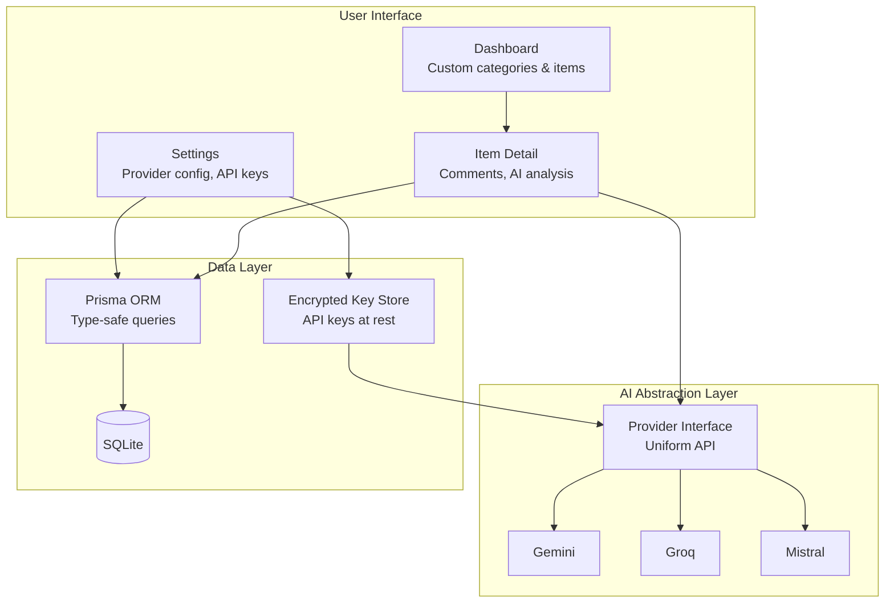
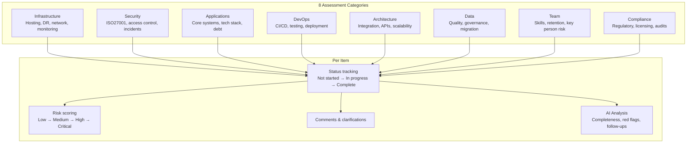
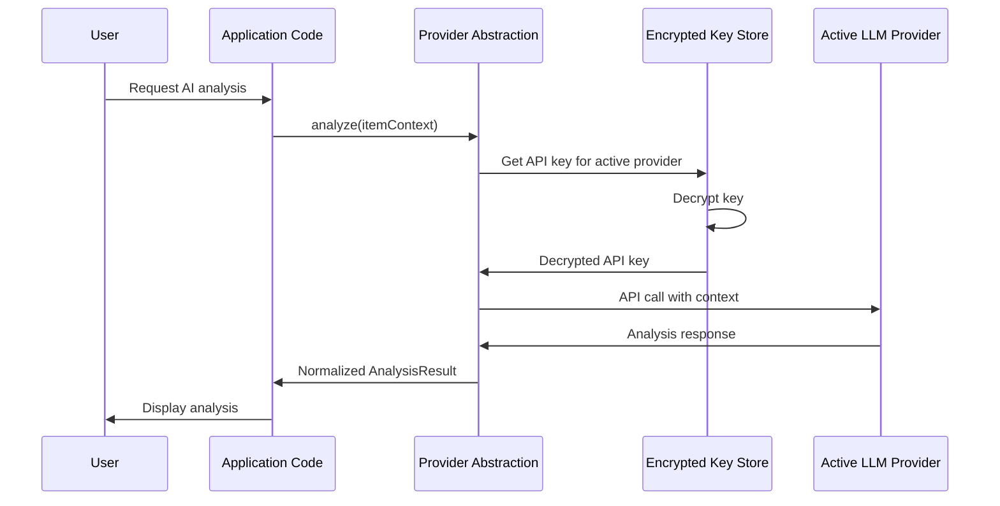
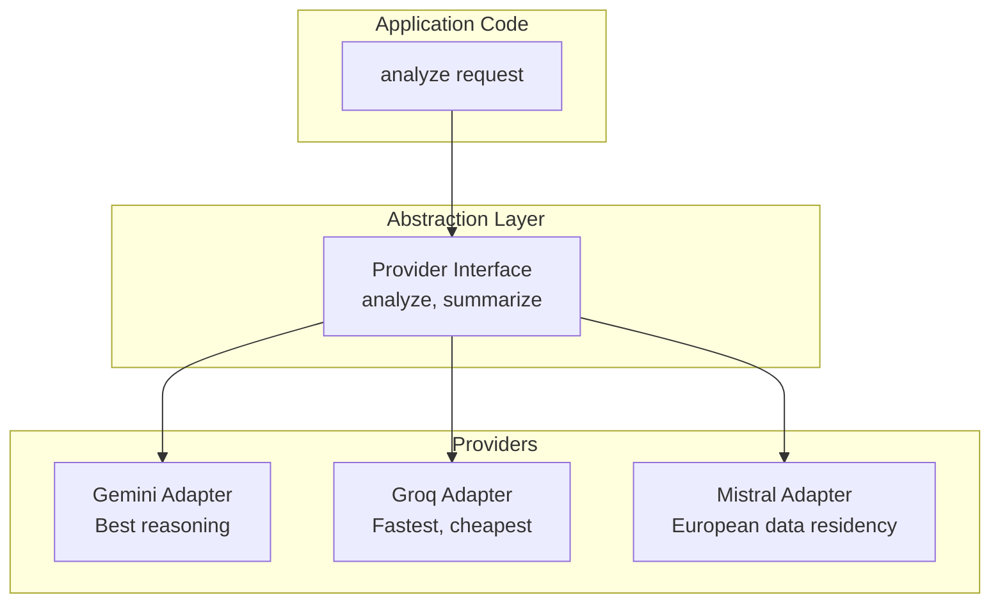
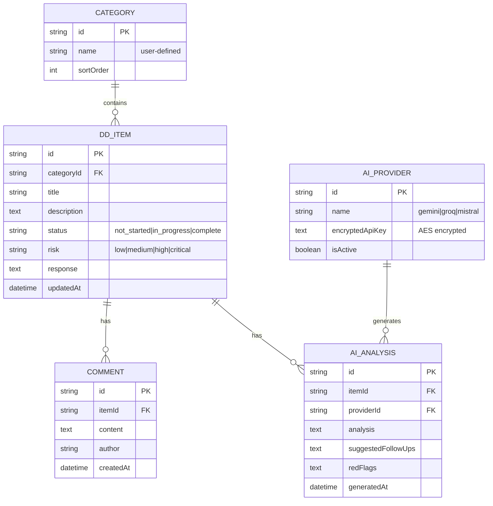

# Claritas — Architecture

## System Overview

## Due Diligence Framework

The category and item structure is fully configurable per project. The default templates are informed by real IT due diligence I've led at Cigna Insurance (TPA acquisition) and Zurich Insurance (retail insurance acquisition).

## Multi-Provider AI Abstraction

**Key pattern:** Application code calls a uniform interface. Provider selection is a configuration concern, not a code concern. Swapping from Gemini to Groq requires changing one setting, not modifying application logic.

**Why three providers?**
| Provider | Strength | When to Use |
|----------|---------|-------------|
| Gemini | Complex reasoning | Deep analysis of architectural risks |
| Groq | Speed and cost | Bulk analysis of straightforward items |
| Mistral | EU data residency | When target company data must stay in EU |

## Data Model

## Security

| Concern | Approach |
|---------|---------|
| API keys at rest | Encrypted in database — never stored as plaintext |
| API keys in transit | HTTPS only, keys loaded into memory only when needed |
| User data | SQLite local-first — no cloud dependency for sensitive DD data |
| LLM data exposure | Only DD item context sent to LLM — no full database exports |

## Technology Choices

| Decision | Choice | Why |
|----------|--------|-----|
| Database | SQLite via Prisma | Local-first. DD data is sensitive — no cloud DB dependency needed. |
| ORM | Prisma 7 | Type-safe, migrations, introspection. Best DX for SQLite. |
| UI | shadcn/ui (51 components) | Consistent, accessible. Faster than building from scratch. |
| AI | Multi-provider abstraction | Provider flexibility for cost, speed, and data residency requirements. |
| Encryption | Application-level | API keys encrypted before database write. Decrypted on read. |
