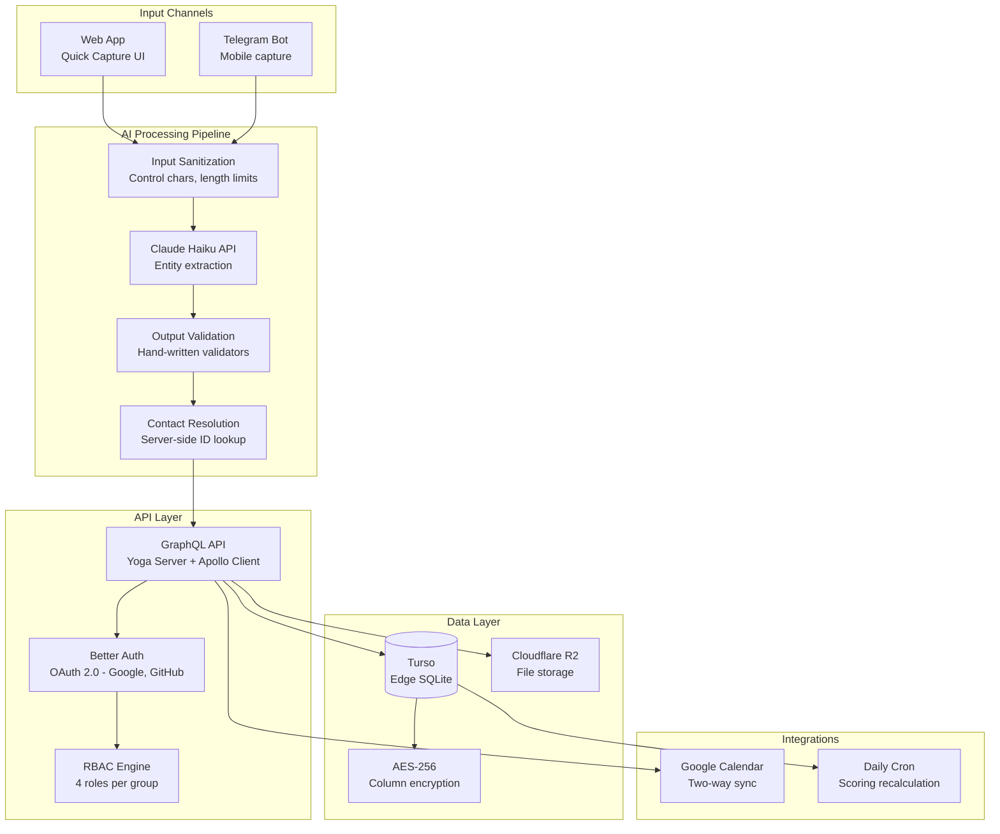
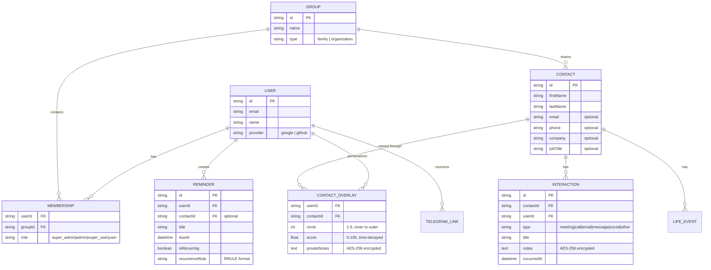
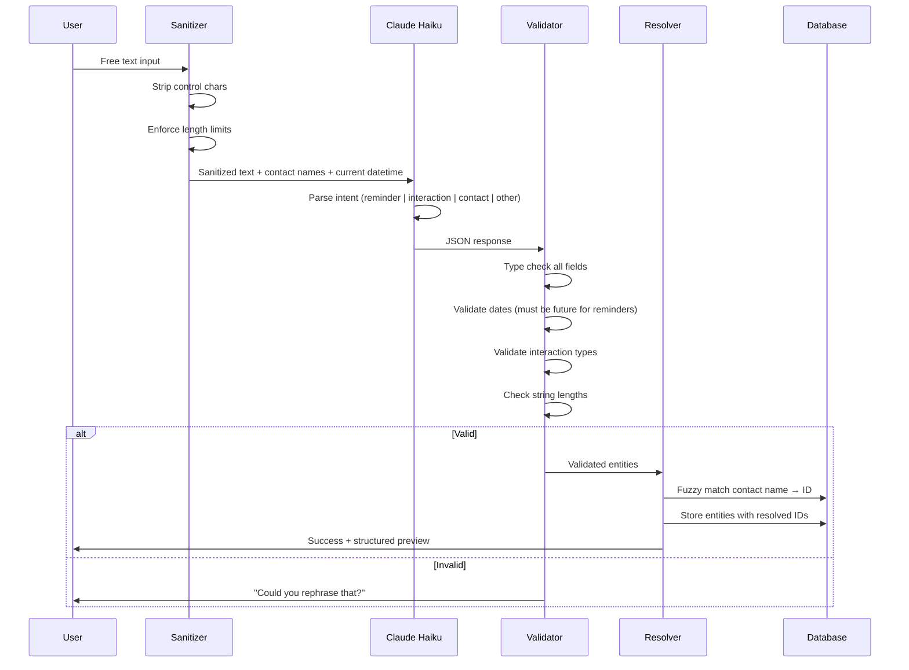
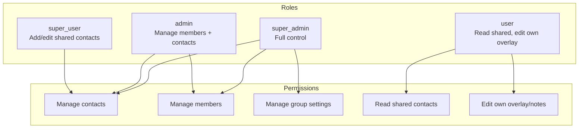

# ConnexusAI — Architecture

## System Overview



## Data Model



**Key design decision: Shared contacts + personal overlays.** Contacts are shared within a group (family/org), but each user has their own overlay — private notes, circle placement, and relationship score. This eliminates duplicate contacts while preserving individual perspective.

## AI Processing Pipeline



**Security boundary:** The LLM receives contact *names* for fuzzy matching but never sees database IDs. Contact ID resolution happens server-side after validation. This prevents prompt injection from referencing arbitrary contacts.

## Relationship Scoring

```mermaid
graph LR
    subgraph Interaction History
        I1[Meeting<br/>weight: 15]
        I2[Call<br/>weight: 10]
        I3[Social<br/>weight: 8]
        I4[Email<br/>weight: 6]
        I5[Message<br/>weight: 4]
    end

    subgraph Time Decay
        D[Exponential decay<br/>30-day half-life<br/>score = weight × e^(-λt)]
    end

    subgraph Output
        S[Aggregate Score<br/>capped at 100]
        C[Circle Placement<br/>1-5 rings]
        R[Reach-out Suggestions<br/>declining scores]
    end

    I1 --> D
    I2 --> D
    I3 --> D
    I4 --> D
    I5 --> D
    D --> S
    S --> C
    S --> R
```

Recalculated daily via cron job. 24-hour staleness is acceptable — relationship health changes slowly.

## Multi-Tenancy & RBAC



## Encryption Strategy

| Data | Encryption | Rationale |
|------|-----------|-----------|
| Name, email, phone, company | None | Needed for server-side search and display |
| Private notes | AES-256 column-level | Sensitive personal observations |
| Interaction notes | AES-256 column-level | May contain confidential details |
| API keys, tokens | Environment variables | Never stored in database |

## Technology Choices

| Decision | Choice | Why Not the Alternative |
|----------|--------|----------------------|
| API style | GraphQL | Relationship data is graph-shaped. REST would require N+1 calls or complex includes. |
| Database | Turso (edge SQLite) | Global edge latency. PostgreSQL was overkill for the data volume. |
| LLM | Claude Haiku | Fastest and cheapest for structured extraction. GPT-4 is slower and more expensive for this use case. |
| Auth | Better Auth + OAuth | Drop-in, supports Google/GitHub. No password management needed. |
| State | Apollo Client + Zustand | Apollo for server cache (GraphQL), Zustand for local UI state. Clean separation. |
| Bot | Telegram | Most accessible for mobile quick capture. WhatsApp Business API has higher friction to set up. |
